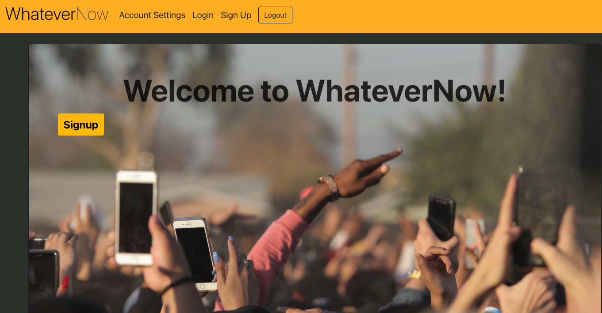
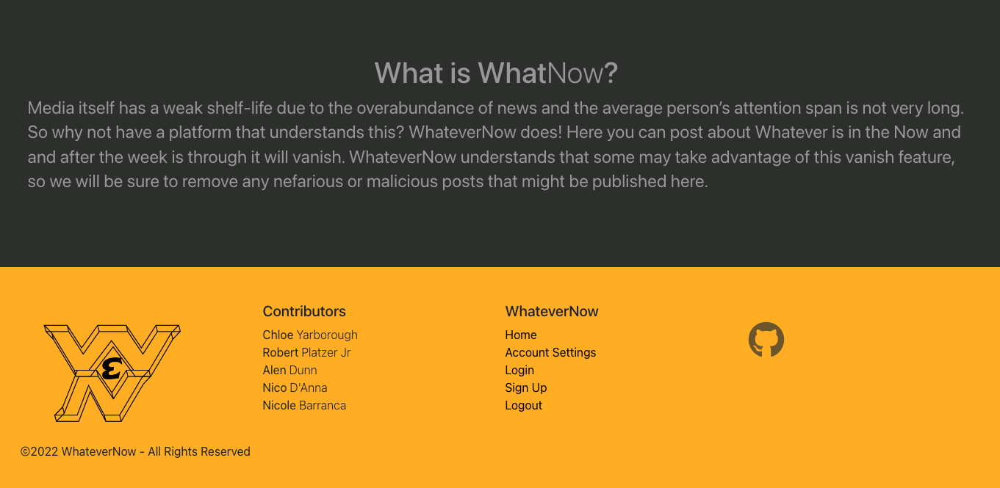

# Whatever-Now

  

<h1 align="center">WhateverNow</h1>

## Table of Contents

* [Description](#description)
* [Built With](#builtwith)
* [Website](#website)
* [Presentation](#presentation)
* [GitHub Rep](#github-repo)
* [Contribution](#contribution)

## Description

WhateverNow is an easy to use social media application where users can create an account and have access to a feed of different posts by various users. The user has the abliity to either sign up or log into an existing account and also update their account settings. 
The posts have both text and photo upload features that will appear in the public feed. This application has been deployed in Heroku.

## Built With

* JavaScript
* React
* GraphQL
* MongoDB
* Express
* Apollo Server Express
* Apollo Client
* JWT
* Dotenv
* Mongoose
* Concurrently

## Website

[WhateverNow Link](https://whatever-now.herokuapp.com/).

</img>

</img>

## Presentation
[WhateverNow Slideshow](https://docs.google.com/presentation/d/1pkEjX24BsfcFGRJR71gzpBZbViNvAlxTuz4mjqxfLMM/edit#slide=id.p) 

## GitHub Repo

[WhateverNow Repo](https://github.com/chloeyarb/Whatever-Now)

## Contribution

* Nicole Barranca
* Chloe Yarborough
* Alen Dunn
* Robert Platzer
* Nico D'Anna
